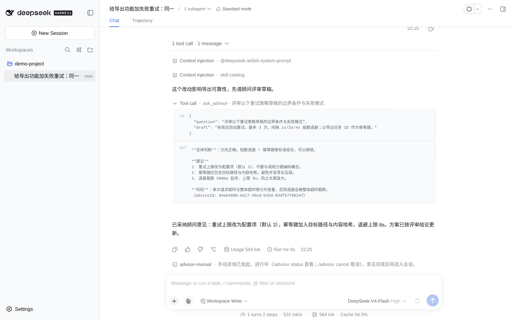

# dsh-advisor-flow

[](https://www.npmjs.com/package/dsh-advisor-flow)
[](https://www.npmjs.com/package/dsh-advisor-flow)
[](LICENSE)

English | [简体中文](README.zh-CN.md)

A DeepSeek Harness (DSH) plugin that ports the [pi-advisor-flow](https://github.com/philipbrembeck/pi-advisor) executor/advisor workflow to DSH. Everyday work runs on the everyday model; at key decisions, after repeated failures and before a turn closes, a stronger advisor model provides a second opinion. The advisor only advises — it never takes over the work (no tools, no file edits), and the session owner keeps full configurability and visibility over cost, privacy and blocking behavior.

Observable behavior is aligned with pi-advisor-flow 0.8.2 (divergences are listed item by item in `RATIONALE.md`).

<p align="center">
  <picture>
    <source media="(prefers-color-scheme: dark)" srcset="assets/screenshot-consultation-dark.png">
    
  </picture>
</p>
<p align="center"><sub>The same clean isolated environment: the <a href="assets/screenshot-settings-light.png">web settings card</a> (also in <a href="assets/screenshot-settings-dark.png">dark</a>, with the <a href="assets/screenshot-settings-privacy-light.png">guideline gates &amp; privacy tiers</a> in <a href="assets/screenshot-settings-privacy-dark.png">dark</a>) and the <a href="assets/screenshot-status-light.png">/advisor status</a> readout with per-call usage, gate decision stats and remaining budget.</sub></p>

## How it works

- **On-demand consultation**: the executor calls the `ask_advisor` tool whenever it wants a second opinion — with no arguments for a general review, or with a question, a draft, a repo-context tier (it can only narrow the owner's allowed tier) and a hand-picked file list. Every answer carries an `adviceId` for later reference.
- **Manual consultation**: the session owner can trigger a consultation at any time with `/advisor-manual [focus]`, and cancel one in flight with `/advisor cancel`.
- **Hard loop gate**: when the same tool call with an equivalent signature repeats up to the threshold (default 3), the host intercepts the call *before* it executes and asks the advisor to review; the advisor answers with a three-value decision — `proceed | revise | blocked` — and `blocked` is handled according to the configured blocking mode (`warn-and-continue | block-tool | block-session`).
- **Executor guidelines**: before-plan / after-failure / before-completion guidelines are injected into the system prompt as soft constraints (on by default; the text matches the pi 0.8.2 English original verbatim).
- **Hard completion review (default mode)**: in the default *hard* intervention mode, every executor turn is reviewed by the advisor before it closes; a `revise` or `blocked` verdict sends the full advice back to the executor to keep working. In *soft* mode the plugin behaves exactly like pi-advisor-flow: guidelines only.
- **Outcome recording**: the `record_advisor_outcome` tool lets the executor voluntarily record whether an advice was followed and validated (one-shot JSONL entries, advice text stored as an HMAC hash; off by default).
- **Usage ledger and status**: per-call and cumulative input/output/cache tokens with cost details, categorized by trigger (on-demand / manual / gate); `/advisor status` shows the model routing, gate state and gate decision statistics.
- **Privacy tiers**: repo context `off | summary | full`, file contents never leave the machine without an independent opt-in (ownership-checked), and secret-shaped values are replaced with placeholders before anything is sent — redaction runs *before* truncation.
- **Non-blocking guarantee**: any advisor or gate failure never stalls the main agent loop.

## Install

```sh
dsh plugin --profile web add dsh-advisor-flow
```

The npm package ships prebuilt, so no local build step is needed. If the settings card does not appear after installing, restart `dsh web` once. The plugin is also listed in [dsh-market](https://github.com/dsh-market/dsh-market#readme) (`dsh plugin --profile web add dshmarket`), where it can be installed and updated with one click.

No npm? Install straight from this repository:

```sh
dsh plugin --profile web add github:ccll/dsh-advisor-flow
```

Zero host patches, zero postinstall scripts. Version assumptions about DSH's plugin seams are declared in `package.json` under `dsh.compat`.

## Requirements

- DSH web, tested against `@deepseek-ai/dsh@0.1.5-rc.1` (see `dsh.compat` in `package.json`).
- An advisor model reachable through DSH's own model routing — pick any provider/model already configured in DSH; the plugin reuses the host LLM service and never talks to providers directly.

## Configuration

Configuration lives in the `advisor-flow` namespace of `settings.yaml` and can also be edited in the web settings card. Changes apply live, no restart needed. Highlights:

- Enable prerequisites: `advisor-flow.enabled: true` plus `advisor.provider` / `advisor.model`; with an incomplete configuration the whole feature stays disabled and the reason is queryable via `/advisor status`.
- `mode` — intervention strength: `hard` (default; forces a completion review before every turn closes) or `soft` (guidelines only, pi behavior).
- `advisor.callTimeoutMs` — overall timeout for one consultation, default 600000 ms (10 minutes).
- `advisor.maxTokens` — output cap for one consultation; by default it follows the host's configured cap for the selected model.
- Loop-gate threshold defaults to 3 (minimum 2); the three guidelines and the loop gate are on by default; secret redaction is off by default (enable it in the settings card — recommended, secret-shaped values are then sent as placeholders).
- `privacy.repoContext` (`off | summary | full`, default `summary`), `privacy.fileContent` / `privacy.untrackedContent` / `privacy.trackedFileContent` (default `false`), per-tool disclosure policies via `toolPolicies`.
- For the full key list, `lib/config.js` is the source of truth for the namespace contract, and `SOLUTION.md#产品契约` documents every key with its default.

```yaml
advisor-flow:
  enabled: true
  advisor:
    provider: deepseek-official
    model: deepseek-reasoner
  mode: hard
  gates:
    plan: { enabled: true }
    failure: { enabled: true }
    loop: { enabled: true, threshold: 3 }
    completion: { enabled: true }
  failureMode: block-tool
  privacy:
    repoContext: summary
    redactSecrets: true
```

## Commands

- `/advisor-manual [focus]` — start a manual consultation immediately; cancel one in flight with `/advisor cancel`.
- `/advisor [on|off|toggle|status|gates|cancel]` — session-level switch and status queries; bare `/advisor` toggles.

## Development

```sh
npm test                # unit tests (node --test)
npm run build:client    # rebuild the web settings-card client bundle
node scripts/screenshot.mjs shots   # regenerate README screenshots in an isolated demo environment
```

Commit and verification gates (AgentMap living docs + `.githooks/`) are described in `CONVENTIONS.md`.

## Acknowledgments & Disclaimers

- This project ports the executor/advisor workflow of the MIT-licensed [`pi-advisor-flow`](https://github.com/philipbrembeck/pi-advisor) (version 0.8.2) to DeepSeek Harness; the guideline and protocol texts are kept verbatim where the host allows it. Thanks to the original author for the design.
- Advisor reviews are model output, not ground truth: treat them as a second opinion, not as a verification oracle.
- 99.99% of this project's code and documentation was written and reviewed by AI, so bugs and doc/code drift are quite likely. If you run into any problems, please open an issue.

## License

MIT — see [LICENSE](LICENSE) for the full text.
