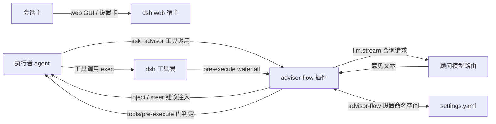
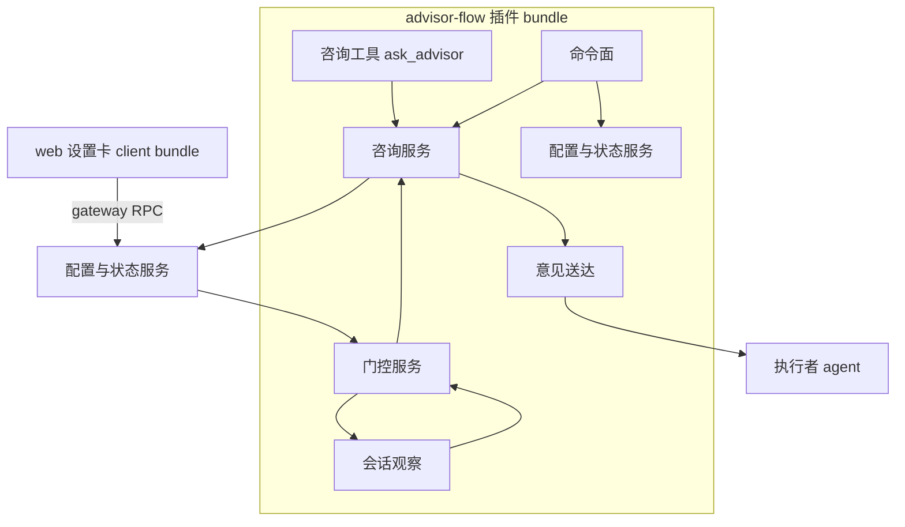
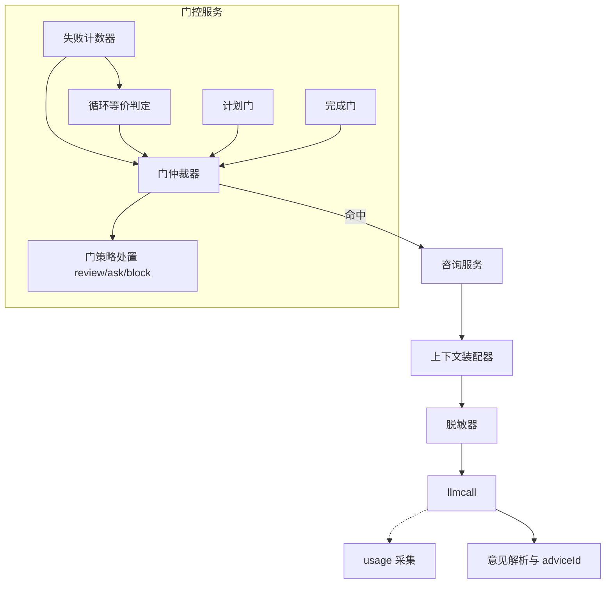
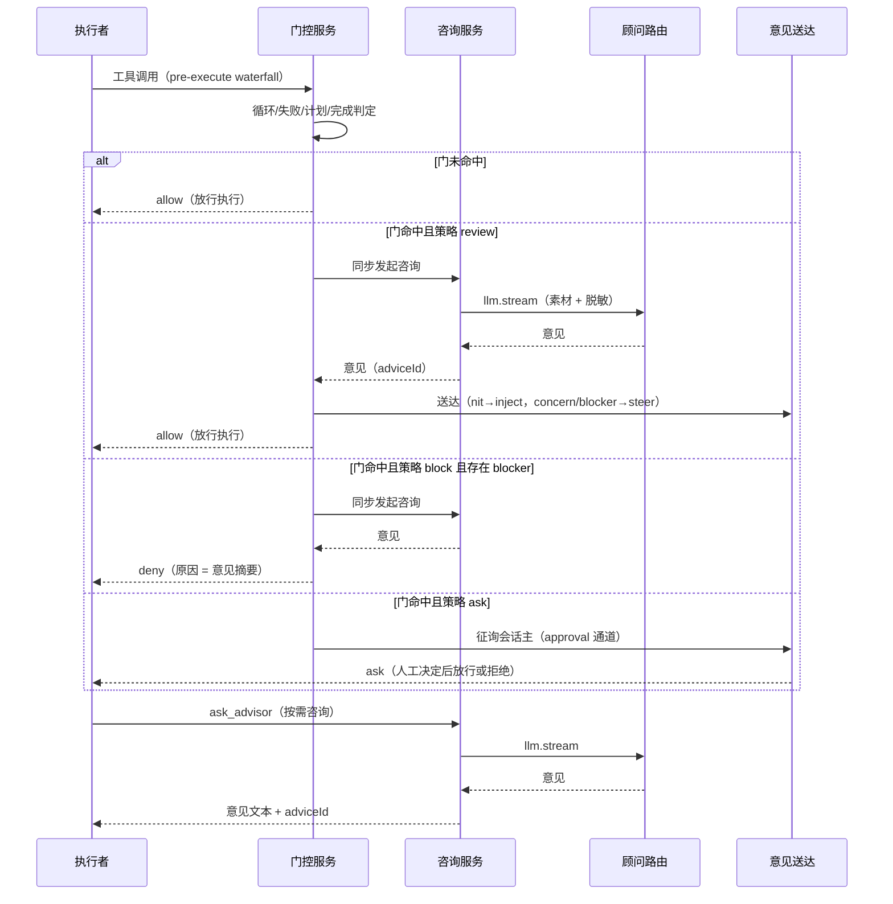
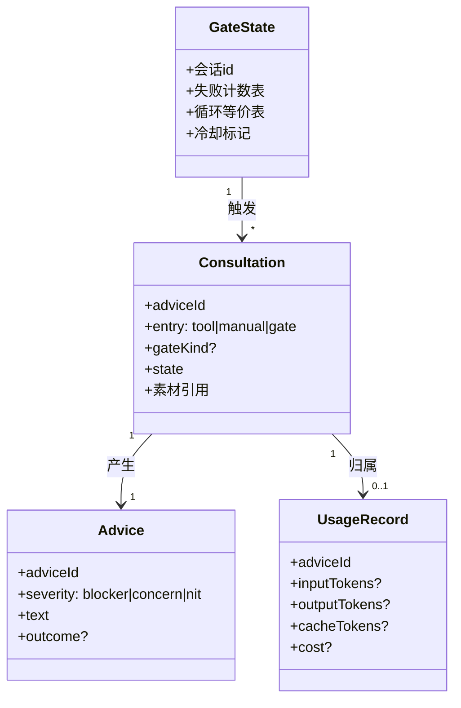
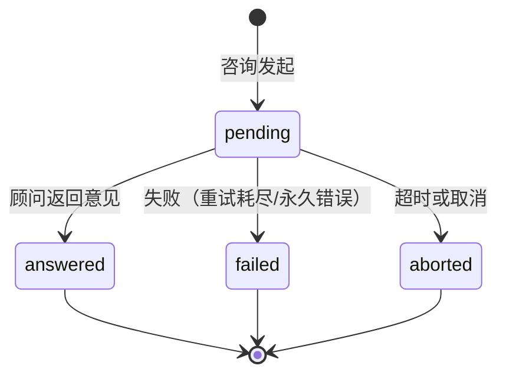
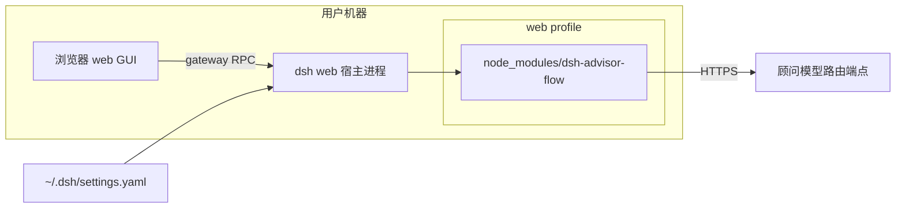
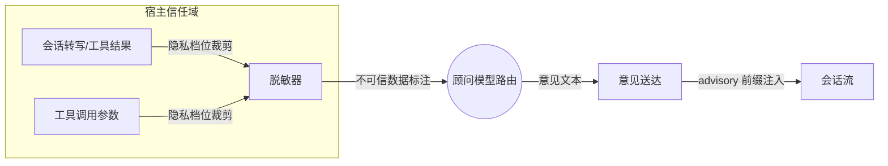
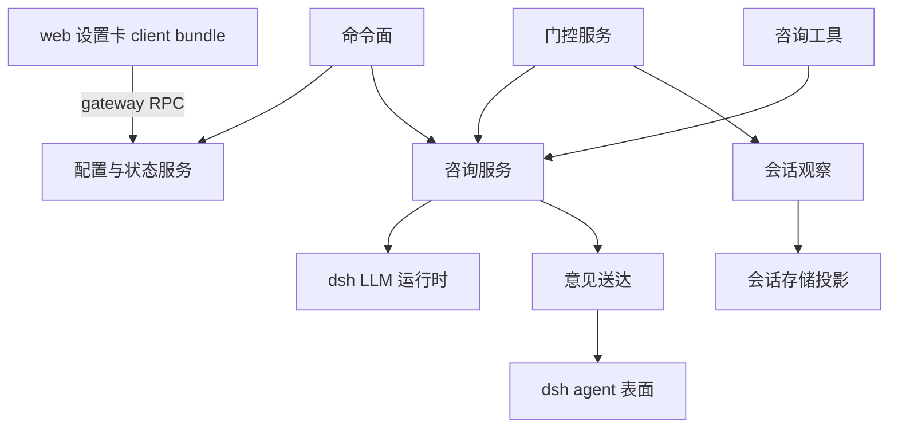

# SOLUTION — 方案层

## 架构视图清单

| 视图 | 适用性/理由 | 图表位置 |
|---|---|---|
| 系统上下文 | 适用: 插件与宿主、执行者、顾问路由、会话主的边界决定全部接缝 | 系统上下文图 |
| 一级静态分解 | 适用: 插件由七个能力模块组成，模块归属需先定 | 一级静态分解图 |
| 内部组件分解 | 适用: 门控服务的判定管线是正确性与非阻断性的核心 | 内部组件分解图 |
| 运行时交互 | 适用: 咨询往返与门阻断是两个架构级时序 | 运行时交互图 |
| 数据与领域模型 | 适用: 咨询/意见/用量/门记录是跨模块数据契约 | 数据与领域模型图 |
| 状态与生命周期 | 适用: 咨询生命周期与顾问运行态是失败语义的载体 | 状态与生命周期图 |
| 数据流与信任边界 | 适用: 会话素材出境与顾问输出入境是隐私设计的主体 | 数据流与信任边界图 |
| 部署 | 适用: 纯 mount 插件在 web profile 的装载方式需要表达 | 部署图 |
| 分层与依赖 | 适用: 客户端卡片与宿主服务的单向依赖需固化 | 分层与依赖图 |
| 系统景观 | 不适用: 单宿主单插件，外部系统景观与系统上下文重合 | — |

## 方案细化清单

| 关注面 | 适用性/理由 | 方案落点 |
|---|---|---|
| 边界与对外契约 | 适用: 工具、命令、设置命名空间、注入消息格式是插件对外稳定面 | SOLUTION.md#产品契约 |
| 核心数据与不变量 | 适用: 咨询与用量记录的结构决定核算与诊断能力 | SOLUTION.md#数据视图 |
| 状态与生命周期 | 适用: 咨询终态一次性约束失败隔离设计 | SOLUTION.md#运行时、并发与失败语义 |
| 运行时、并发与失败语义 | 适用: 门内联等待与非阻断保证的相互作用是本方案最大风险点 | SOLUTION.md#运行时、并发与失败语义 |
| 外部集成 | 适用: LLM 路由、宿主工具层、会话存储三类集成缝 | SOLUTION.md#静态架构 |
| 配置与可变点 | 适用: 全部行为档位收敛到一个设置命名空间 | SOLUTION.md#产品契约 |
| 安全与信任边界 | 适用: 素材出境与意见入境双向信任问题 | SOLUTION.md#数据视图 |
| 部署、迁移与恢复 | 适用: web profile 装载与版本升级路径 | SOLUTION.md#部署视图 |
| 兼容性与版本演进 | 适用: 依赖 dsh 插件接缝的版本契约需声明 | SOLUTION.md#部署视图 |
| 可观测性与运维 | 适用: 状态查询与失败显性化是 R-02-003 的落点 | SOLUTION.md#运行时、并发与失败语义 |

## 实现就绪检查

| 条件 | 结论 | 证据或落点 |
|---|---|---|
| 边界与契约已明确 | 通过 | SOLUTION.md#产品契约 |
| 关键不变量已明确 | 通过 | DOMAIN.md#跨模块不变量 |
| 重大方案选择已收敛 | 通过 | RATIONALE.md（C-001～C-003） |
| 目标实现归属已明确 | 通过 | SOLUTION.md#子系统与模块 |
| 现状差距已有 task 承接 | 通过 | 全新实现，无现状差距；首个 task 于实现阶段建立 |
| 可派生验证 | 通过 | SOLUTION.md#运行时、并发与失败语义 |

## 静态架构

### 系统上下文图

- 插件不修改 dsh 源码（纯 mount）；全部接缝为公开事件与服务。

### 一级静态分解图

### 内部组件分解图

- 观察器只读：从 `session/event` 消费 `tool/call` 与结果事件，维护每会话失败计数与循环等价表。
- 仲裁器单一出口：`allow / ask / deny(reason)`，命中即同步触发咨询。
- 失败路径与成功路径同样经过仲裁器；门组件自身异常按放行处置并记录。

## 运行时视图

### 运行时交互图

- 门内联等待有硬上限（`callTimeoutMs`）；超时按非阻断放行并记录。

## 数据视图

### 数据与领域模型图

- 用量缺失项显式记 `unavailable`，不得落零。
- 素材不出现在意见与用量记录中，只存脱敏摘要与长度计数。

### 状态与生命周期图

- 顾问运行态另有三态：`active / paused(quota) / halted(permanent)`；paused 可经 `/advisor on` 恢复，halted 需重建。
- 终态一次性；终态后只允许追加 outcome。

## 部署视图

### 部署图

- 安装：`dsh plugin --profile web add dsh-advisor-flow`（npm 发布，含构建产物）。
- 升级：版本替换 + 设置键向前兼容；无宿主补丁、无 postinstall。

## 补充架构视图

### 内部组件分解图

见「静态架构 → 一级静态分解图」之上的内部组件分解图；门仲裁器为唯一判定出口，观察器为唯一事件入口，两者经每会话状态隔离。

### 数据流与信任边界图

- 出境侧：素材按档位裁剪后才可出境；脱敏在裁剪后、发送前执行。
- 入境侧：顾问输出按不可信数据处理，仅以 advisory 前缀消息进入会话流，永不作为工具结果或系统指令。
- 密钥形状值在出境侧被占位替换；脱敏关闭时明确告知会话主风险（设置卡提示）。

### 分层与依赖图

- 依赖单向：客户端 → 宿主服务 → dsh 公开缝；禁止反向与环。

## 产品契约

- **咨询工具** `ask_advisor`：
  - 入参：`question?: string`、`draft?: string`；均可省略（一般性评审）。
  - 返回：意见文本 + `adviceId`；失败返回带诊断码的错误（`NO_ADVISOR_MODEL` / `ADVISOR_ROUTE_MISSING` / `ADVISOR_TIMEOUT` 等）。
- **命令**：
  - `/advisor-manual [focus]`：立即咨询；进行中可取消。
  - `/advisor status`：启用态、模型路由、各门状态、待处理数、最近活动、累计用量摘要。
  - `/advisor gates`：门配置与阈值只读回读。
  - `/advisor on|off|toggle`：会话级临时开关，不写持久配置；裸 `/advisor` 等价 toggle（UX 增项，契约在此补记）。
- **设置命名空间** `advisor-flow`（settings.yaml 顶层键）：
  - `enabled`（默认 false）、`advisor.provider`、`advisor.model`、`advisor.reasoningEffort?`、`advisor.maxTokens`、`advisor.callTimeoutMs`、`advisor.retryAttempts`（瞬态重试次数，默认 1）
  - `gates.plan|failure|loop|completion`：各含 `enabled`、`policy(review|ask|block)`、阈值（failure/loop 另有 `threshold`，failure 另有 `policy(block|block-session)`）
  - `privacy.history(off|delta|window)`、`privacy.repoContext(none|summary|patch)`、`privacy.toolResults(off|capped)`、`privacy.toolResultMaxBytes`（capped 档字节上限）、`privacy.fileContent(默认 false)`、`privacy.redactSecrets`
  - `budget.maxPerSession`（0 = 不限）
  - 未知键警告保留；缺 provider/model 时整体禁用且状态可查询。
- **注入消息格式**：`[advisor:{severity}] <摘要>`；意见正文附 adviceId 引用。

## 需求追溯索引

| 需求 | 主责子系统 | 方案落点 | 实现位置 |
|---|---|---|---|
| R-01-001 | 咨询服务 | SOLUTION.md#咨询服务 | lib/consultation.js；lib/tools/ask-advisor.js |
| R-01-002 | 咨询服务 | SOLUTION.md#命令面 | lib/commands.js |
| R-01-003 | 门控服务 | SOLUTION.md#门控服务 | lib/gates/plan.js |
| R-01-004 | 门控服务 | SOLUTION.md#门控服务 | lib/gates/failure.js |
| R-01-005 | 门控服务 | SOLUTION.md#门控服务 | lib/gates/loop.js |
| R-01-006 | 门控服务 | SOLUTION.md#门控服务 | lib/gates/completion.js |
| R-02-001 | 配置与状态服务 | SOLUTION.md#配置与状态服务 | lib/config.js；lib/client/card-state.js；lib/client/render.js |
| R-02-002 | 配置与状态服务 | SOLUTION.md#配置与状态服务 | lib/usage.js |
| R-02-003 | 配置与状态服务 | SOLUTION.md#配置与状态服务 | lib/status.js |
| R-02-004 | 咨询服务 | SOLUTION.md#数据流与信任边界图 | lib/context.js；lib/redact.js |
| R-02-005 | 咨询服务 | SOLUTION.md#运行时、并发与失败语义 | lib/consultation.js；lib/gates/index.js |

## 子系统与模块

### 咨询服务
- 职责: 顾问模型调用的唯一入口——上下文组装（隐私裁剪、脱敏）、llm.stream 调用（根作用域 LLM 解析、reasoningEffort 能力门控）、意见解析（自由文本，宽松 JSON 兼容）、adviceId 分配、用量记录（承接 R-01-001、R-01-002、R-02-004、R-02-005）
- 关键内部结构:
  - LLM 服务从应用根解析（`ctx.root?.get('llm') ?? ctx.llm`），防隔离作用域 NO_ADAPTER。
  - `resolveModelInfo` 能力门控 effort：仅模型声明时发送，缺省不传（路由 defaultEffort 会物化，须显式传 off 等级）。
  - `maxTokens` 与 `callTimeoutMs` 可配置；deadline 融合 dispose 信号，race 每 chunk。
  - 失败三分类：transient（重试 1 次）/ quota（pause）/ permanent（halt）；对工具调用表现为带诊断码的当次错误。
  - 意见为自由文本，不做严格 JSON 帧约定；严重度由顾问显式声明，缺省 nit。
- 代码位置: lib/consultation.js；lib/context.js；lib/redact.js
- 实现: 单端（宿主）

### 门控服务
- 职责: 注册 `tools/pre-execute` waterfall 监听，对计划/失败/循环/完成四门做前置判定与处置（承接 R-01-003～R-01-006）
- 关键内部结构:
  - 判定数据来自会话观察器维护的每会话 `GateState`。
  - 计划门锚定 `exit_plan_mode` 类工具；完成门锚定 `concludesTurn` 工具；失败/循环门锚定观察器计数。
  - 命中即同步 `await` 咨询，处置按门策略：review 放行+送达；ask 转 approval 通道；block 且 blocker 即 deny(reason)。
  - 门组件异常 fail-open（放行 + 记录），咨询超时同此。
- 代码位置: lib/gates/
- 实现: 单端（宿主）

### 会话观察
- 职责: 全局订阅 `session/event`，维护有界转写增量与工具调用/结果统计，供咨询上下文组装与门判定（承接 R-01-004、R-01-005 的观测面）
- 关键内部结构:
  - 监听必须 `{ global: true }`（跨 scope 会话事件）。
  - 压缩/重写事件重置观察游标与计数。
  - 消费 `tools/pre-execute|result` 生命周期事件维护失败计数与循环等价表。
- 代码位置: lib/observer.js
- 实现: 单端（宿主）

### 意见送达
- 职责: 意见到会话的路由——severity → `agent.inject`（nit，非唤醒）/ `agent.steer`（concern/blocker，唤醒）；维护会话级 agent 映射（承接 R-01-003~006 的意见送达）
- 关键内部结构:
  - `agent/created` 注册 + 注册表回退双通道。
  - immuneTurns 冷却防止意见风暴。
- 代码位置: lib/delivery.js
- 实现: 单端（宿主）

### 配置与状态服务
- 职责: `advisor-flow` 命名空间注册与 live re-apply（signature 变更才重建运行时）；web 设置卡 gateway RPC（get/set）；用量台账；状态快照（承接 R-02-001、R-02-002、R-02-003）
- 关键内部结构:
  - 设置解析器拒绝非法值但保留未知键并警告。
  - 状态快照含启用态、路由、门状态、pending、最近活动、用量摘要。
  - 失败显性化：丢弃/超时/配额一律 info 级日志带原因。
- 代码位置: lib/settings.js、lib/usage.js、lib/status.js
- 实现: 单端（宿主）+ client 卡片

### 咨询工具
- 职责: 注册 `ask_advisor` 工具面，参数校验与错误转译（承接 R-01-001）
- 关键内部结构: 工具体仅转发咨询服务，不含判定逻辑。
- 代码位置: lib/tools/ask-advisor.js
- 实现: 单端（宿主）

### 命令面
- 职责: `/advisor-manual`、`/advisor status|gates|on|off|toggle` 命令挂载（承接 R-01-002、R-02-003）
- 代码位置: lib/commands.js
- 实现: 单端（宿主）

### web 设置卡
- 职责: 设置页 Advisor Flow 卡片（开关、模型、门矩阵、隐私档位），经自有 gateway RPC 读写（承接 R-02-001 的 GUI 面）
- 代码位置: lib/client/
- 实现: client bundle（web profile）

## 横切约束

- 非阻断性优先于功能完整：任何 advisor 路径不得 park 主循环（见 DOMAIN 不变量）。
- 门内联等待是唯一同步点，且受 `callTimeoutMs` 硬约束、超时 fail-open。
- 观察与判定不读会话持久化文件，只依赖事件流与投影。
- 插件零宿主补丁、零 postinstall；对 dsh 插件接缝（pre-execute、session/event、inject/steer、settings、gateway RPC、命令注册）的版本假设在 package.json 声明。

## 运行时、并发与失败语义

- **门内联等待**：门命中时工具调用暂停等待咨询完成（同步 await），上限 `callTimeoutMs`（默认 180s，可配）；超时/失败按放行处置并记录（R-02-005 AC-02）。`ask` 策略走宿主 approval 通道，拒绝即 deny。
- **失败分类**：transient → 重试 1 次（1s 退避）→ 丢弃并记录；quota → 暂停并保留待处理；permanent（NO_ADAPTER、模型不存在、凭证无效）→ halt 顾问（门按放行处置，工具调用返回诊断错误）。
- **丢弃可见性**：每次丢弃记录 info 级日志（原因 + 会话 + 入口类型），状态可查。
- **并发**：同会话咨询串行（FIFO，容量上限，满则丢新）；不同会话并行互不影响。
- **重入防护**：咨询工具自身被门拦截豁免（防止门触发咨询的工具调用自递归）；顾问调用不经过工具层。
- **恢复**：paused 由 `/advisor on` 原地恢复；halted 由命令重建运行时；配置 signature 变更原子重建，在飞调用经 dispose 信号收束。

## 横切约束

- 全部 dsh 接缝调用点：`ctx.root.get('llm')`、`llm.resolveModelInfo` 能力门控、`ctx.on('tools/pre-execute')`、`ctx.on('session/event', …, {global:true})`、`agent.inject/steer`、settings bridge `onChange`、GatewayService RPC、命令注册表。
- 思考型顾问路由默认 effort 可能为 max：调用必须显式携带能力门控后的 effort；预算与超时可配置，不得硬编码。
- 日志统一 `ctx.logger('advisor-flow')`，失败原因 info 级可见。
