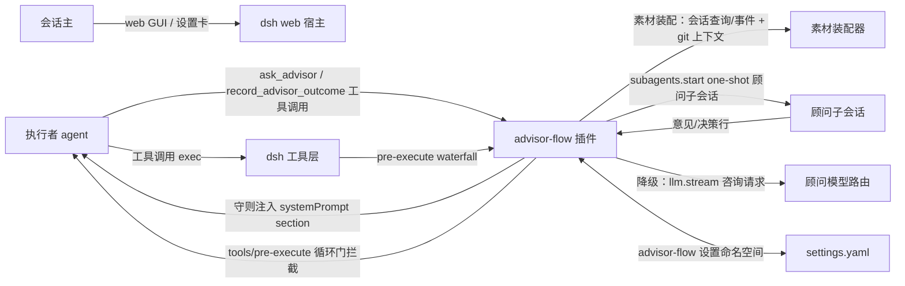
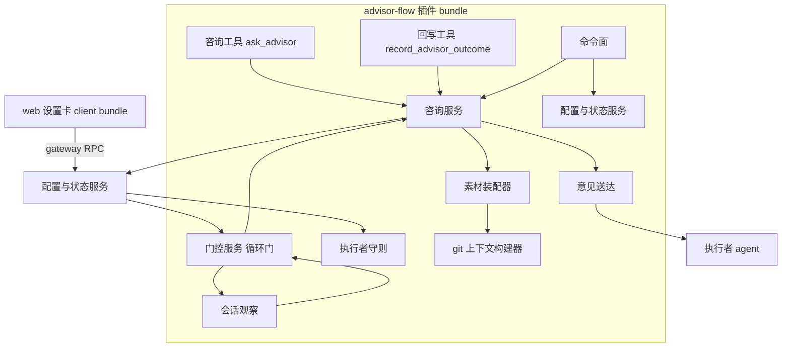
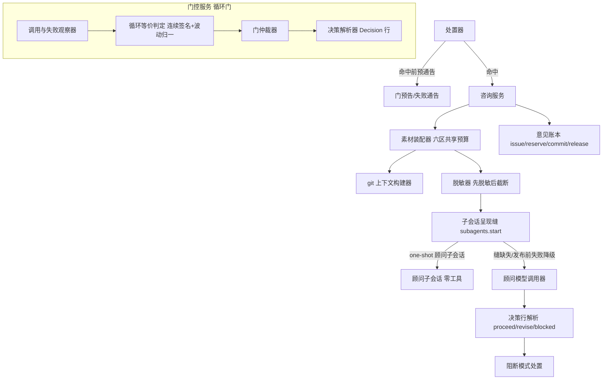
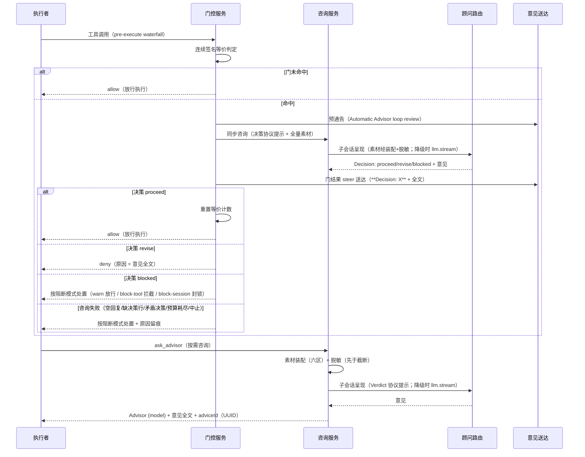
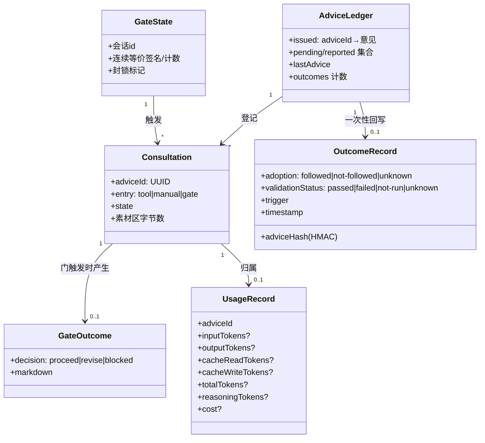
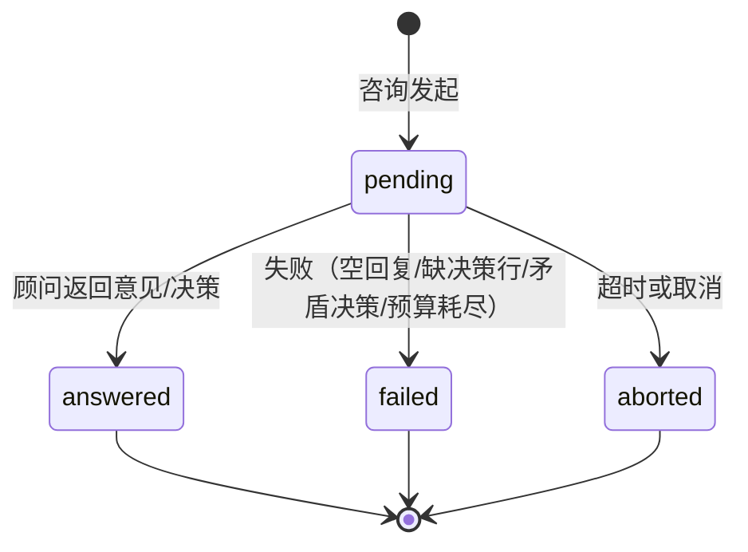
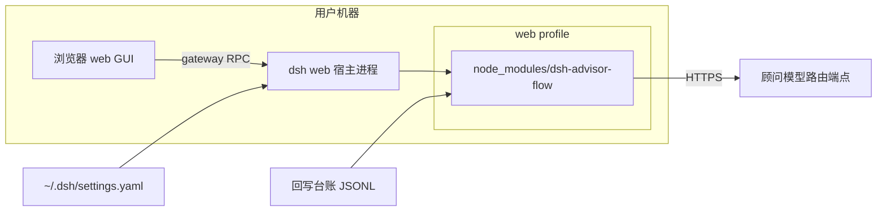
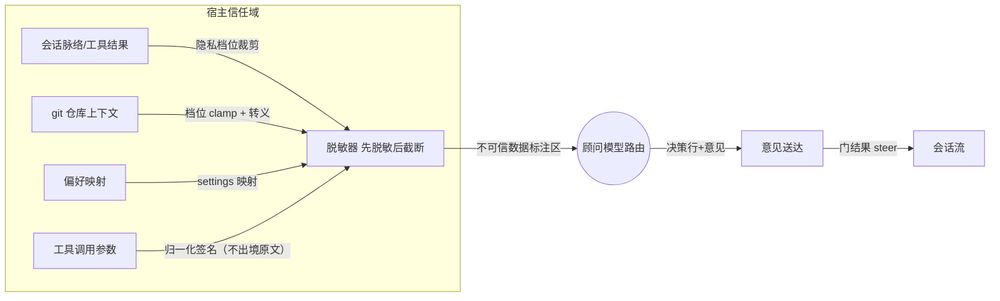
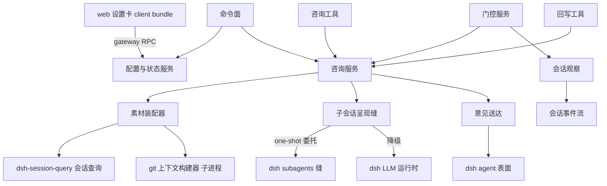

# SOLUTION — 方案层

> 对齐基线：pi-advisor-flow@0.8.2 npm 制品（sha256 ead4e3a2…，C-009）；除宿主无法承载项外行为严格一致，分歧账本（gap → 对齐/适配/豁免）由东家裁决（C-008）：T-011 承载 0.8.2 审计差距的原始账本（已终态）；此后的新增偏离以 RATIONALE C-nnn 追加承载（东家签字即该裁决条目，如 C-015）。

## 架构视图清单

| 视图 | 适用性/理由 | 图表位置 |
|---|---|---|
| 系统上下文 | 适用: 插件与宿主、执行者、顾问路由、会话主的边界决定全部接缝 | 系统上下文图 |
| 一级静态分解 | 适用: 插件由十个能力模块组成，模块归属需先定 | 一级静态分解图 |
| 内部组件分解 | 适用: 门控判定管线与素材装配管线是正确性、隐私与非阻断性的核心 | 内部组件分解图 |
| 运行时交互 | 适用: 咨询往返、门阻断与素材出境是三个架构级时序 | 运行时交互图 |
| 数据与领域模型 | 适用: 咨询/意见/用量/门记录/意见台账是跨模块数据契约 | 数据与领域模型图 |
| 状态与生命周期 | 适用: 咨询生命周期、意见回写生命周期与顾问运行态是失败语义的载体 | 状态与生命周期图 |
| 数据流与信任边界 | 适用: 会话素材出境与顾问输出入境是隐私设计的主体 | 数据流与信任边界图 |
| 部署 | 适用: 纯 mount 插件在 web profile 的装载方式需要表达 | 部署图 |
| 分层与依赖 | 适用: 客户端卡片与宿主服务的单向依赖需固化 | 分层与依赖图 |
| 系统景观 | 不适用: 单宿主单插件，外部系统景观与系统上下文重合 | — |

## 方案细化清单

| 关注面 | 适用性/理由 | 方案落点 |
|---|---|---|
| 边界与对外契约 | 适用: 工具、命令、设置命名空间、注入消息格式是插件对外稳定面 | SOLUTION.md#产品契约 |
| 核心数据与不变量 | 适用: 咨询/用量/意见账本记录的结构决定核算与诊断能力 | SOLUTION.md#数据视图 |
| 状态与生命周期 | 适用: 咨询终态一次性与意见回写一次性约束失败隔离设计 | SOLUTION.md#运行时、并发与失败语义 |
| 运行时、并发与失败语义 | 适用: 门内联等待与非阻断保证的相互作用是本方案最大风险点 | SOLUTION.md#运行时、并发与失败语义 |
| 外部集成 | 适用: LLM 路由、宿主工具层、会话存储、git 四类集成缝 | SOLUTION.md#静态架构 |
| 配置与可变点 | 适用: 全部行为档位收敛到一个设置命名空间，默认值对齐 pi（偏离项: failureMode 默认 block-tool，C-017） | SOLUTION.md#产品契约 |
| 安全与信任边界 | 适用: 素材出境与意见入境双向信任问题 | SOLUTION.md#数据流与信任边界图 |
| 部署、迁移与恢复 | 适用: web profile 装载与版本升级路径 | SOLUTION.md#部署视图 |
| 兼容性与版本演进 | 适用: 依赖 dsh 插件接缝的版本契约需声明；工具参数 2→6 为兼容性变更 | SOLUTION.md#部署视图 |
| 可观测性与运维 | 适用: 状态查询、门决策统计与失败显性化是 R-02-003 的落点 | SOLUTION.md#运行时、并发与失败语义 |

## 实现就绪检查

| 条件 | 结论 | 证据或落点 |
|---|---|---|
| 边界与契约已明确 | 通过 | SOLUTION.md#产品契约 |
| 关键不变量已明确 | 通过 | DOMAIN.md#跨模块不变量 |
| 重大方案选择已收敛 | 通过 | RATIONALE.md（C-001～C-009） |
| 目标实现归属已明确 | 通过 | SOLUTION.md#子系统与模块 |
| 现状差距已有 task 承接 | 通过 | SOLUTION.md#分阶段交付 |
| 可派生验证 | 通过 | SOLUTION.md#运行时、并发与失败语义 |

## 静态架构

### 系统上下文图

- 插件不修改 dsh 源码（纯 mount）；全部接缝为公开事件与服务。
- 执行者守则经 `ctx.systemPrompt.section` 注入（文本函数实时求值，配置变更即时生效）。
- 素材出境统一经装配器（会话脉络 + git 上下文 + 偏好映射 + 草稿 + 附件）与脱敏器（先脱敏后截断）。

### 一级静态分解图

### 内部组件分解图

- 观察器只读：从 `tools/result` 消费结果事件维护失败与循环计数；`session/event` 仅承载压缩/重置。
- 循环门是唯一硬门：命中即同步咨询，决策三值（proceed/revise/blocked）按阻断模式处置。
- 门组件自身异常 fail-open（放行 + 记录）；咨询失败按阻断模式处置。
- 素材装配是咨询唯一通道：三入口（工具/手动/门）共用同一装配管线（R-02-006）。

## 运行时视图

### 运行时交互图

- 门内联等待有硬上限（`callTimeoutMs`）；超时按阻断模式处置并记录。
- 三类守则（计划/失败/收尾）+ 公共约定行（空对象调用/自定义触发/剩余次数预告）经 `ctx.systemPrompt.section` 注入执行者系统提示（文本函数实时求值），非拦截门；硬拦截门仅循环门。
- 门咨询被 caller 中止时的放行/拦截极性为 staging 实弹验证项（审计 G-13，待核）。

## 数据视图

### 数据与领域模型图

- 用量缺失项显式记 `unavailable`，不得落零。
- 素材不出现在意见与用量记录中，只存脱敏摘要与长度计数；回写记录以 HMAC 哈希承载意见原文，不落明文。

### 状态与生命周期图

- 顾问运行态仅 `active`（可用）与 `disabled`（配置缺失整体禁用）；无独立暂停/停机态。
- 终态一次性；意见账本另含回写生命周期：issued →（reserve）pending →（commit）reported /（release）回 pending；reported 后不可再次回写（R-01-008/AC-02）。

## 部署视图

### 部署图

- 安装：`dsh plugin --profile web add dsh-advisor-flow`（npm 发布，含构建产物）。
- 升级：版本替换 + 设置键向前兼容；无宿主补丁、无 postinstall。
- 兼容性注记：ask_advisor 参数面 2→6 为对既有调用方的扩展（旧 question/draft 语义不变，新增参数均可选）；旧配置键（privacy.history 等）经未知键警告保留，迁移说明见产品契约。

## 补充架构视图

### 内部组件分解图

见「静态架构 → 一级静态分解图」之上的内部组件分解图；门仲裁器为唯一判定出口，观察器为唯一事件入口，素材装配器为唯一出境口，三者经每会话状态隔离。

### 数据流与信任边界图

- 出境侧：素材按档位裁剪 → 脱敏 → 截断（pi 顺序：先脱敏后截断，防截断边界密钥残片）；六区以 pi 原文相同的 XML 标签与不可信注记呈现，除仓库变更区外均经转义。
- 入境侧：顾问输出按不可信数据处理，仅以 advisory 前缀消息进入会话流，永不作为工具结果或系统指令。
- 密钥形状值在出境侧被占位替换（六类形状，R-02-004/AC-03）；脱敏关闭时明确告知会话主风险（设置卡提示）。

### 分层与依赖图

- 依赖单向：客户端 → 宿主服务 → dsh 公开缝；禁止反向与环。

## 产品契约

- **咨询工具** `ask_advisor`（文案与参数面逐字对齐 pi 0.8.2，英文原文）：
  - 入参：`question?`、`draft?`、`gitContext?`（none|summary|full，执行者只可收窄）、`includeTrackedFiles?`（tracked 相对路径清单，需顾问点名 + 全局授权）、`includeUntracked?`（新文件清单，需授权）、`force?`（不实现——依附 Jev 筛查，NG-6）。
  - 工具描述/参数描述/pi `promptGuidelines` 文案：从 pi 0.8.2 源程序化提取，逐字等值断言（deviation 零容忍）。
  - 返回：文本 = `Advisor ({model})

{markdown}` + adviceId（UUID 形态）回查行；空意见按失败处置（诊断码）。
  - 失败诊断码：`NO_ADVISOR_MODEL` / `ADVISOR_TIMEOUT` / `ADVISOR_FAILED` / `ADVISOR_GATE_INVALID` / `ADVISOR_BUDGET_EXHAUSTED`。
- **回写工具** `record_advisor_outcome`：
  - 入参：`adviceId`、`adoption`（followed/not-followed/unknown）、`validationStatus`（passed/failed/not-run/unknown）。
  - 一次性语义：reserve→commit 成功；release 失败可重试；未知/已回写/未决 adviceId 报错。
  - 落盘：JSONL + HMAC 哈希（密钥插件生成）+ 跨进程锁 + 1MB 轮转；开关 `outcomeLogging` 默认 false。
- **命令**：
  - `/advisor-manual [focus]`：立即咨询；进行中可取消；失败经 steer 送达含原因通告；新请求中止并替换在飞请求。
  - `/advisor status`：启用态、模型路由、守则开关与循环门配置、待处理数、最近活动、累计用量摘要、逐次明细、剩余次数、门决策统计与干预计数。
  - `/advisor gates`：守则开关、循环门阈值与阻断模式只读回读。
  - `/advisor on|off|toggle`：会话级临时开关，不写持久配置；裸 `/advisor` 等价 toggle（UX 增项，契约在此补记）。
- **设置命名空间** `advisor-flow`（settings.yaml 顶层键；默认值对齐 pi 0.8.2，C-008；偏离项: failureMode 默认 block-tool，C-017）：
  - `enabled`（默认 false）、`advisor.provider`、`advisor.model`、`advisor.reasoningEffort?`、`advisor.maxTokens?`（可选；缺省 = 跟随宿主对所选模型的配置——经 llm.resolveModelInfo 取模型声明值，未声明则省略请求参数；显式配置覆盖）、`advisor.callTimeoutMs`（默认 600000，偏离 pi 180s 记 C-015）（无重试）
  - `contextMaxChars`（默认 15000）、`gitContextMaxChars`（默认 20000）
  - `gates.plan|failure|completion`：`enabled`（默认 true，守则开关）
  - `gates.loop`：`enabled`（默认 true）、`threshold`（默认 3，下界 2）
  - `failureMode`：`block-tool`（默认；偏离 pi 0.8.2 的 block-session，记 C-017）/ `warn-and-continue` / `block-session`
  - `blockOnBlocked`（默认 true：blocked 决策时是否尽力停止当前执行）
  - `customInvocation`（可选字符串：自定义触发条件）
  - `modelWhitelist`（可选清单：顾问模型白名单，门/手动/轮询入口检查）
  - `toolPolicies`（工具名 → full|summary|exclude，per-tool 披露策略，默认 full）
  - `privacy.repoContext(off|summary|full，默认 summary)`、`privacy.toolResultMaxBytes`、`privacy.toolResultMaxLines`、`privacy.fileContent(默认 false，tracked)`、`privacy.untrackedContent(默认 false)`、`privacy.trackedFileContent(默认 false，tracked 移交授权，R-01-001/AC-07)`、`privacy.redactSecrets(默认 false，对齐 pi；开启时六类形状替换)`
- `userPreferences`（可选非空字符串，缺省=无偏好区；素材装配偏好区来源，R-02-006/AC-05）
- `scout.enabled`（默认 false；Scout 策展二次调用开关）与 `scout.timeoutMs`（缺省 = 不限，接线层兜底 30s；T-014）
- `presentation`：`subagent`（默认；咨询经 `ctx.subagents.start` one-shot 顾问子会话发起，会话界面出现顾问子会话条目，R-02-007）/ `direct`（保持 llm.stream 直调，无子会话条目）；非法值按库纪律拒绝（invalid-value-rejected，与 failureMode 同型），配置被拒时功能禁用且原因可查；子会话缝缺失或发布前发起失败时自动降级 direct 并显性化（R-02-007/AC-03，运行时语义）
  - `budget.maxPerSession`（未配置 = 不限）
  - `outcomeLogging`（默认 false）
  - 旧键迁移：`privacy.history(off|delta|window)`、`privacy.repoContext(none|summary|patch)`、`privacy.toolResults(off|capped)` 为旧键，警告保留不生效，卡片提供迁移提示；未知键警告保留；缺 provider/model 时整体禁用且状态可查询。
- **注入消息格式**：
  - 门命中预通告：`Automatic Advisor loop review`（含阈值说明，steer）。
  - 门结果：`**Decision: {proceed|revise|blocked}**

{markdown}`（steer）。
  - 门失败：`**Advisor gate failure ({category}):** {message}`（steer，含 warn-and-continue 放行路径）。
  - 按需咨询意见走工具返回值（不注入），文本附 adviceId 回查行；手动失败通告：`Manual Advisor consultation failed: {message}`。
- **顾问请求素材契约**（R-02-006）：单条 user 消息，六区结构 `<conversation>` → `<repository_changes note=…>` → `<untracked_files>` → `<tracked_files>` → `<user_preferences>` → `<draft>`，末尾 `Targeted focus:{question}`；除仓库变更区外全部经转义；各带 pi 原文相同的不可信注记；空素材兜底文案与 pi 一致。

## 需求追溯索引

| 需求 | 主责子系统 | 方案落点 | 实现位置 |
|---|---|---|---|
| R-01-001 | 咨询服务 | SOLUTION.md#咨询服务 | lib/consultation.js；lib/tools/ask-advisor.js |
| R-01-002 | 咨询服务 | SOLUTION.md#命令面 | lib/commands.js |
| R-01-003 | 执行者守则 | SOLUTION.md#执行者守则 | lib/guidelines.js |
| R-01-004 | 执行者守则 | SOLUTION.md#执行者守则 | lib/guidelines.js |
| R-01-005 | 门控服务 | SOLUTION.md#门控服务 | lib/gates/index.js；lib/observer.js |
| R-01-006 | 执行者守则 | SOLUTION.md#执行者守则 | lib/guidelines.js |
| R-01-007 | 执行者守则 | SOLUTION.md#执行者守则 | lib/guidelines.js |
| R-01-008 | 咨询服务 | SOLUTION.md#咨询服务 | lib/outcomes.js；lib/tools/record-outcome.js |
| R-02-001 | 配置与状态服务 | SOLUTION.md#配置与状态服务 | lib/config.js；lib/client/card-state.js；lib/client/render.js |
| R-02-002 | 配置与状态服务 | SOLUTION.md#配置与状态服务 | lib/usage.js；lib/status.js |
| R-02-003 | 配置与状态服务 | SOLUTION.md#配置与状态服务 | lib/status.js |
| R-02-004 | 咨询服务 | SOLUTION.md#数据流与信任边界图 | lib/redact.js；lib/materials.js；lib/consultation.js（collectFileEntries） |
| R-02-005 | 咨询服务 | SOLUTION.md#运行时、并发与失败语义 | lib/consultation.js；lib/gates/index.js |
| R-02-006 | 咨询服务 | SOLUTION.md#咨询服务 | lib/materials.js；lib/git-context.js；lib/observer.js |
| R-02-007 | 咨询服务 | SOLUTION.md#咨询服务 | lib/subsession.js；lib/consultation.js |

## 子系统与模块

### 咨询服务
- 职责: 顾问模型调用的唯一入口——经素材装配器的上下文组装（六区共享预算、先脱敏后截断）、子会话呈现缝发起（`subagents.start` one-shot 顾问子会话，缝缺失或发布前失败降级 llm.stream 直调；承接 R-02-007）、reasoningEffort 能力门控、两套回复协议的英文提示词（按需咨询 Verdict 行 / 循环门 Decision 行）、决策行对抗性解析、UUID adviceId 分配、意见账本（issue/reserve/commit/release）、用量记录（承接 R-01-001、R-01-002、R-01-008、R-02-004、R-02-005、R-02-006、R-02-007）
- 关键内部结构:
  - LLM 服务从应用根解析（`ctx.root?.get('llm') ?? ctx.llm`），防隔离作用域 NO_ADAPTER。
  - 子会话呈现缝（R-02-007）：呈现提供方经已注册名单解析（`subagents.list()`），无可用提供方即发布前失败——按降级语义走 llm.stream；`start()` 发布成功后的 run 失败一律映射诊断码，不得降级重发（AC-04）。
  - `resolveModelInfo` 能力门控 effort：仅模型声明时发送（记适配：pi 无条件发送）。
  - `maxTokens`（缺省跟随宿主模型配置：resolveModelInfo.defaultMaxTokens，未声明省略参数；显式配置覆盖）与 `callTimeoutMs`（默认 600000，C-015）可配置；deadline 融合 dispose 信号，race 每 chunk。
  - 失败无重试：咨询失败（provider 错误/空回复/缺决策行/矛盾决策行/预算耗尽）直接上抛为门失败类别，按阻断模式处置。
  - 意见为自由文本原样采用（无 JSON 解包——dsh-advisor 谱系遗留物退役）；空意见 = 失败（AdvisorNoAdviceError 语义）；按需咨询协议为英文 `Verdict: sound` 首行约定。
  - 意见账本：issue（含 normalizedQuestion 与 draft 标记）→ outcome 回写 reserve/commit/release 一次性；`reattachAdvice` 同问去重（归一化 question 匹配历史意见）；预留生命周期随引擎实例存活——引擎重建/会话终止时未决预留释放，不跨进程持久。
- 代码位置: lib/consultation.js；lib/subsession.js；lib/materials.js；lib/redact.js；lib/outcomes.js
- 实现: 单端（宿主）

### 素材装配器
- 职责: 六区顾问请求消息的唯一装配点——会话脉络（事件增量观察 / dsh-session-query）、git 上下文（档位 clamp、共享预算切分、五态注记）、偏好区（settings 映射）、草稿（cap+脱敏）、tracked/untracked 附件（归属校验、单文件 8KB、总预算 24KB）、per-tool 披露策略应用（承接 R-02-004、R-02-006）
- 关键内部结构:
  - 预算切分：git 预算 = min(gitContextMaxChars, ⌊contextMaxChars/2⌋)；会话预算 = contextMaxChars − 变更区实际长度；披露警示为控制元数据不占 git 预算。
  - 消息布局与不可信注记、转义规则逐字对齐 pi `advisorMessageText`；空消息兜底一致。
  - tracked 移交验证：所列路径必须全部被顾问最近意见点名（词边界匹配），认领一次性消费 `lastAdvice`。
  - 会话脉络来源双轨：主轨 dsh-session-query（装配时查询当前会话条目）；备轨事件增量缓冲（observer 维护，压缩/重写重置）——T-012 spike 裁决主轨可行性后定稿。
  - 会话脉络词汇识别（T-015）：非表面事件跳过集以宿主运行时词汇表为权威——动态导入宿主已知事件词汇推导（宿主根包导出 `KNOWN_SESSION_EVENT_TYPES`；部署前提：项目 node_modules 以符号链接指向宿主树同包），导入失败回落兜底集（实弹观测伴生全集 + 实证炸点类型）；fail-closed 仅对宿主词汇也不认识的非 ignorable 事件生效。
- 代码位置: lib/materials.js；lib/conversation-source.js；lib/git-context.js；lib/consultation.js（collectFileEntries）
- 实现: 单端（宿主）

### Scout 策展
- 职责: 二次顾问调用对会话脉络做按组策展（required 强制保留、其余按预算填充、synthesis 附不可信注记、整体硬截断），任何失败/超时回退 legacy 脉络（实现 T-014 Scout 计量与 spike；Scout 永不阻断咨询主流程）
- 关键内部结构: 纯策展逻辑（runScout 执行缝注入）；引擎接线已落地（runScout 经 llm 缝的二次调用，计量 scout 口径）
- 代码位置: lib/scout.js
- 实现: 单端

### git 上下文构建器
- 职责: 仓库上下文采集——变更文件名与 shortstat（summary 档）、full 档含 patch、untracked 名单；转义与脱敏先于截断；子进程预算（5s/16MB）与空树 fallback（承接 R-02-006）
- 关键内部结构: `escapeRepositoryText` 收集期转义保持字节预算精确；`clampGitContextLevel` 执行者只可收窄；gitContextNote 五态注记（disabled/failed/no-changes/not-a-repository/受限）。
- 代码位置: lib/git-context.js
- 实现: 单端（宿主）

### 门控服务
- 职责: 注册 `tools/pre-execute` waterfall 监听，对等价签名**连续**重复前置拦截、预通告、同步咨询（全量素材）、解析 `Decision` 三值决策并按阻断模式处置（承接 R-01-005）
- 关键内部结构:
  - 连续签名计数：本次签名 ≠ 上一次签名时计数归 1（pi 语义）；波动归一（timestamp/date/datetime→占位、correlationId/requestId/traceId→占位、临时路径归一、bash 命令空白归一）；`ask_advisor` 豁免。
  - 载体契约（dsh-tools 0.1.5-rc.2 实测）：工具名 `exec.name`、参数 `exec.arguments`、会话 `exec.agent.id`。
  - 决策处置矩阵：proceed → steer 送达门结果 + 重置计数 + 放行；revise → steer 送达 + deny(意见全文)；blocked → 按阻断模式处置（warn-and-continue 放行 / block-tool 拦截 / block-session 会话封锁；blockOnBlocked 控制 stopSession）。
  - 门命中先发预通告（`Automatic Advisor loop review`）再咨询；门问句不携带当次参数；咨询失败按阻断模式处置；决策行解析含对抗性检查。
  - 门组件异常 fail-open（放行 + 记录）。
- 代码位置: lib/gates/index.js
- 实现: 单端（宿主）

### 执行者守则
- 职责: 计划/失败/收尾三类关键节点守则与公共约定行的生成与注入——经 `ctx.systemPrompt.section` 注册文本函数，按活配置实时求值；全部文案为 pi 0.8.2 英文原文逐字（承接 R-01-003、R-01-004、R-01-006、R-01-007）
- 关键内部结构:
  - 单 section 注册（text 为函数；全关时返回空串）。
  - 文案来源：程序化提取自冻结制品（C-009），等值断言入测试。
  - 注入前置：咨询工具缝激活且模型访问允许，否则不注入（R-01-007/AC-04）。
  - 自定义触发行与剩余次数预告行按配置展开（pi 模板）。
- 代码位置: lib/guidelines.js
- 实现: 单端（宿主）

### 会话观察
- 职责: 订阅 `tools/result` 与 `session/event`，维护连续签名等价计数、失败连击、会话脉络增量缓冲与工具结果内容缓存（per-tool 策略）（承接 R-01-005、R-02-006 的观测面）
- 关键内部结构:
  - 生命周期事件监听必须 `{ global: true }`。
  - pre-execute 权威计数（连续签名制）；成败计数权威缝 `tools/result`（`result.isError`、`exec.callId` 去重）。
  - 压缩/重写事件重置观察游标、计数与脉络缓冲。
  - 工具结果内容环形缓存受字节/行双上限与 toolPolicies 约束，供素材装配取用。
- 代码位置: lib/observer.js
- 实现: 单端（宿主）

### 意见送达
- 职责: 门结果意见到会话的送达——一律 `agent.steer`（唤醒式）；预通告、门结果、失败通告三种文本形状（承接 R-01-005）
- 关键内部结构:
  - `agent/created` 注册 + 注册表回退双通道。
  - 无 severity 分流、无冷却（pi 原生语义）。
- 代码位置: lib/delivery.js
- 实现: 单端（宿主）

### 配置与状态服务
- 职责: `advisor-flow` 命名空间注册与 live re-apply；settings section 注册；web 设置卡 gateway RPC；用量台账（逐次+累计+剩余次数）；状态快照（含门决策统计与干预计数）（承接 R-02-001、R-02-002、R-02-003）
- 关键内部结构:
  - 设置解析器拒绝非法值但保留未知键并警告；默认值 SSOT 对齐 pi 0.8.2（C-008），偏离项 failureMode 默认 block-tool（C-017）。
  - 新键：customInvocation、modelWhitelist、blockOnBlocked、toolPolicies、contextMaxChars、gitContextMaxChars、privacy.repoContext(off|summary|full)、privacy.toolResultMaxLines、privacy.untrackedContent、privacy.trackedFileContent、outcomeLogging；旧键警告保留。
  - 状态快照含启用态、路由、门状态、pending、最近活动、用量摘要、逐次明细、剩余次数、决策统计。
- 代码位置: lib/config.js、lib/settings.js、lib/gateway.js、lib/usage.js、lib/status.js
- 实现: 单端（宿主）+ client 卡片（lib/client/）

### 咨询工具
- 职责: 注册 `ask_advisor` 工具面（六参数英文 schema），参数校验与错误转译（承接 R-01-001）
- 关键内部结构: 工具体仅转发咨询服务；`output {schema, render}` 强制；value 契约 `{ok:true,adviceId,text}|{ok:false,code,reason}`；render 前缀 `Advisor (model)`。
- 代码位置: lib/tools/ask-advisor.js
- 实现: 单端（宿主）

### 回写工具
- 职责: `record_advisor_outcome` 工具面——adoption/validationStatus 枚举校验、一次性预留提交（承接 R-01-008）
- 关键内部结构: 枚举 whitelist 与 pi ADOPTIONS/VALIDATIONS 一致；禁用态返回提示值；落盘经 lib/outcomes.js（JSONL+HMAC+锁+轮转）。
- 代码位置: lib/tools/record-outcome.js；lib/outcomes.js
- 实现: 单端（宿主）

### 命令面
- 职责: `/advisor-manual`、`/advisor status|gates|on|off|toggle` 命令挂载（承接 R-01-002、R-02-003）
- 关键内部结构: manual 并发替换（新请求 abort 在飞）；失败 steer 通告；status 含逐次明细/剩余次数/决策统计。
- 代码位置: lib/commands.js
- 实现: 单端（宿主）

### web 设置卡
- 职责: 设置页 Advisor Flow 卡片（开关、模型、门矩阵、新配置键、隐私档位、风险提示），经自有 gateway RPC 读写（承接 R-02-001 的 GUI 面）
- 关键内部结构: 旧键迁移提示；redactSecrets=false 风险提示（C-008 ②）；顾问区数字输入 `advisor.callTimeoutMs`（占位默认 600000）与 `advisor.maxTokens`（占位「跟随所选模型配置」），清空 = 回归缺省（T-016）。
- 代码位置: lib/client/
- 实现: client bundle（web profile）

## 横切约束

- 非阻断性优先于功能完整：任何 advisor 路径不得 park 主循环（见 DOMAIN 不变量）。
- 门内联等待是唯一同步点，且受 `callTimeoutMs` 硬约束、超时按阻断模式处置。
- 素材出境单一通道：三入口（工具/手动/门）一律经素材装配器；禁止旁路直拼消息。
- 宿主载体契约（T-008 实测，dsh 0.1.5-rc.1 / dsh-tools 0.1.5-rc.2）：工具载体 `{name, arguments, agent, callId, token, signal}`；结果缝 `(exec, result)`、失败真值 `result.isError`；送达消息 content 为 ContentBlock 数组且带 id；工具定义必须含 `output {schema, render}`；执行者守则经 `ctx.systemPrompt.section`（text 函数实时求值）。
- LLM 请求契约（T-009 staging 实测，dsh-llm GenerateOptions）：`messages[].content` 为 ContentBlock 数组；`system` 为字符串；流 chunk 为 `text-delta`/`usage`/`finish`。
- 用量契约（T-009 staging 核对，dsh-llm TokenUsage）：离散计数，无 `cacheTokens` 与 `cost` 字段；台账未收到的字段记 unavailable。
- 对齐契约：行为基准为 pi-advisor-flow@0.8.2 冻结制品（C-009）；制品出处为 npm registry（权威源，完整性字段见 C-009），本地 .tmp-audit/ 仅为缓存副本，可凭校验和复现；文案逐字等值断言（程序化字符串表）；分歧账本记录每项 对齐/适配/豁免（C-008）——原始账本承载于 T-011（终态），此后的新增偏离以 RATIONALE C-nnn 追加记账（如 C-015）。
- 插件零宿主补丁、零 postinstall；对 dsh 插件接缝的版本假设在 package.json 声明。
- 宿主服务访问双原语（装载期实测教训）：必选服务声明式 `inject = ['agents', 'llm']`；可选服务一律条件 `ctx.inject` 子上下文；绝不以 try/catch 探测 ctx 代理属性。tools 特殊：条件子上下文 + 注册失败 fail loud（ask_advisor 与 record_advisor_outcome 为用户面）。
- package.json 必须声明 `exports` 段含 `./client` 子路径。
- 全部 dsh 接缝调用点：`ctx.root.get('llm')`、`llm.resolveModelInfo` 能力门控、`ctx.on('tools/pre-execute')`、`ctx.on('tools/result')`、`ctx.on('session/event', …, {global:true})`、`agent.steer`、`ctx.systemPrompt.section`、settings bridge `onChange`、GatewayService RPC、命令注册表、dsh-session-query（素材脉络，T-012 spike 确认形态）、`ctx.subagents.list()/start()`（子会话呈现缝，R-02-007）。
- 思考型顾问路由默认 effort 可能为 max：调用必须显式携带能力门控后的 effort；预算与超时可配置，不得硬编码。
- 日志统一 `ctx.logger('advisor-flow')`，失败原因 info 级可见。

## 运行时、并发与失败语义

- **门内联等待**：循环门命中时工具调用暂停等待咨询完成（同步 await），上限 `callTimeoutMs`（默认 600s，可配，C-015）；超时按阻断模式处置并记录。
- **子会话呈现语义**（R-02-007）：`presentation=subagent`（默认）时咨询经 `subagents.start(呈现提供方, {label, prompt, parent, signal, agentOptions, toolFilter})` 以 one-shot 顾问子会话发起——label 标识顾问与入口（`Advisor review (tool|manual|gate)`），prompt 承载装配素材（六区契约不变），`agentOptions` 覆盖为顾问路由（provider/model/能力门控 effort/maxTokens），`toolFilter={allow:[]}` 零工具（NG-1），协议提示经子会话 persona 承载；结算 `SubagentResult.output` 取意见文本（非文本块过滤），空输出 = 失败（AC-06），`stopReason: 'error'` 映射 ADVISOR_FAILED。发布前失败（缝缺失、名单无提供方、start 拒绝）降级 llm.stream 直调并记降级原因（AC-03）；发布后的 run 失败不降级重发（AC-04）。run 句柄在结算或中止后于 finally 无条件 `dispose()`。
- **失败处置**：无重试——咨询失败（provider 错误、空回复、缺决策行、矛盾决策行、预算耗尽）上抛为门失败类别，按阻断模式处置，原因 info 级留痕。
- **abort 极性（待核）**：门咨询遇 caller 中止时的放行/拦截方向，pi 为拦截、port 现为按阻断模式处置（warn-and-continue 下放行）——staging 实弹复现后定极性（审计 G-13）。
- **丢弃可见性**：每次丢弃/处置记录 info 级日志（原因 + 会话 + 入口类型），状态可查。
- **并发**：同会话咨询串行（FIFO，容量上限，满则丢新）；手动咨询新请求替换在飞；不同会话并行互不影响。
- **重入防护**：咨询工具自身被循环门豁免；顾问调用不经过工具层（子会话呈现经 `subagents` 服务缝，非工具调用）。
- **会话封锁**：block-session 模式下 blocked 决策使会话进入封锁态——`blockOnBlocked`（默认 true）时宿主 `agents.cancel` 尽力停止当前执行，且后续所有工具调用一律拦截（拒绝原因 = 封锁原因），直至会话重建。
- **恢复**：无独立暂停/停机态；配置 signature 变更原子重建，在飞调用经 dispose 信号收束。

## 分阶段交付

- **T-011 契约与守则对齐**：文案英文化（程序化断言）、六参工具面、UUID/空意见/前缀、Decision 语义、守则三行+custom+预算行+前置条件、连续计数+波动归一+threshold 下界、门预告/通告/问句、manual 替换+失败可见、JSON 解包移除、默认值对齐（failureMode 后经 C-017 偏离为 block-tool）、新配置键、白名单、blockOnBlocked。
- **T-012 素材出境链**（先 spike）：会话脉络来源双轨裁决（dsh-session-query vs 事件增量）、git 上下文构建器、六区装配与共享预算、attachments 归属校验与移交验证、per-tool 策略、redact 六模式+先脱敏后截断、偏好映射。
- **T-013 回写与用量面**：record_advisor_outcome 工具+JSONL/HMAC/锁/轮转、逐次明细查询面、剩余次数、决策统计、设置卡同步。
- **T-014 Scout 移植**（spike 先行）：manifest 分组→选组→重建→回退链路移植；依赖 T-012 素材管道；执行者模型解析缝待核，不可承载回报东家。
- 验证锚点：dump 实际出站请求对照 pi 契约；交错序列门计数回归；跨截断边界脱敏负向断言；advice 文本恒等断言（G-15）。
